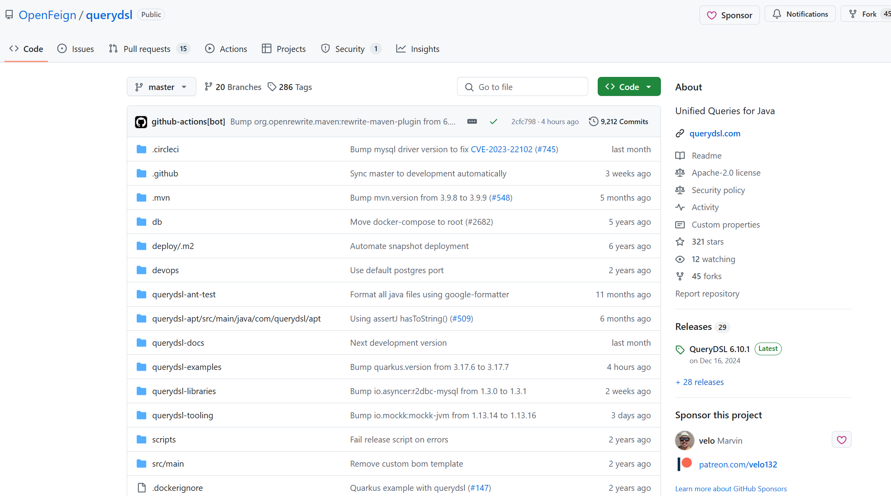
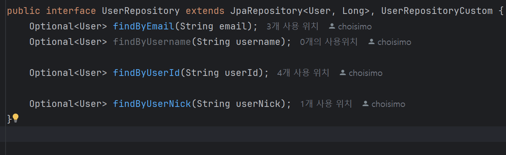
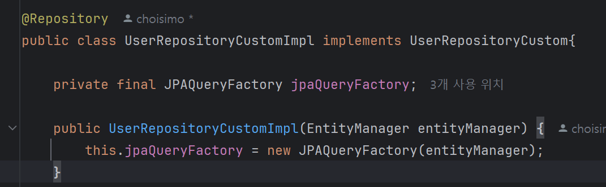

### [OpenFeign querydsl 깃허브 주소](https://github.com/OpenFeign/querydsl)



```text
필자는 Java 17, SpringBoot 3.3.7,
QueryDsl 6.10.1 버전에서 실행하였다.
```

#### ext
```properties
ext {
	queryDslVersion = "6.10.1"
}
```

#### dependencies
```properties
dependencies{
    implementation "io.github.openfeign.querydsl:querydsl-core:${queryDslVersion}"
    implementation "io.github.openfeign.querydsl:querydsl-jpa:${queryDslVersion}"
    annotationProcessor "io.github.openfeign.querydsl:querydsl-apt:${queryDslVersion}:jpa"
    annotationProcessor "jakarta.annotation:jakarta.annotation-api"
    annotationProcessor "jakarta.persistence:jakarta.persistence-api"
}
```

```text
연관된 dependencies 를 추가하고 gradle 새로고침
후에 gradle build 하여 QueryDSL 클래스들을 
생성할 수 있도록 한다.
```

### Configuration 
```java
@Configuration
public class QueryDslConfig {

    @Bean
    public JPAQueryFactory jpaQueryFactory(EntityManager entityManager) {
        return new JPAQueryFactory(entityManager);
    }
}
```

### 기존 UserRepository

```java
public interface UserRepository extends JpaRepository<User, Long> {}
```

#### QueryDSL 사용을 위한 QueryDSL 전용 repository 생성 및 extends
```java
public interface UserRepository extends JpaRepository<User, Long>, UserRepositoryCustom {}
```
설명
```text
UserRepositoryCustom 인터페이스를 만들어서 
UserRepository에서 상속 받을 수 있게 하자
이후, UserRepositoryCustomImpl class 를 생성하고, 
UserRepositoryCustom interface 를 구현하자
```




